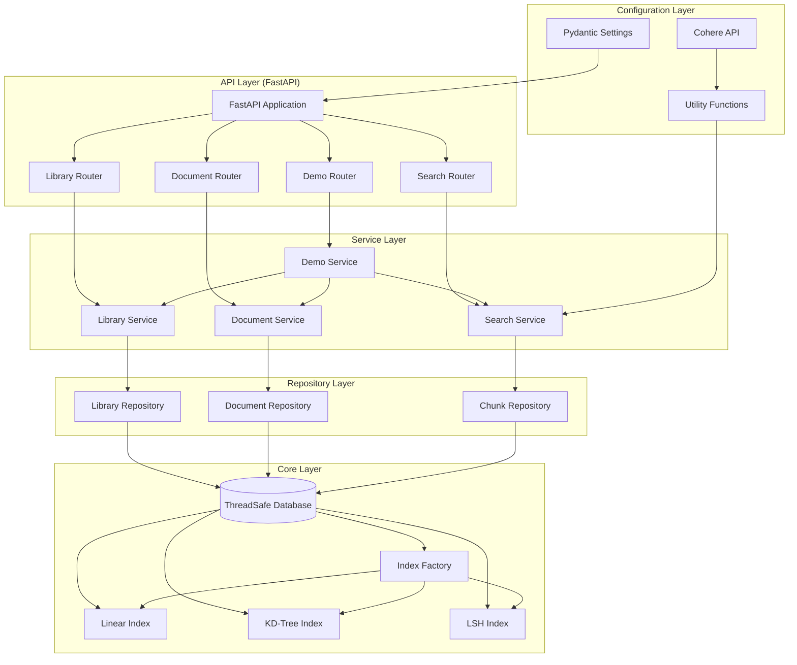

# VectorAI

A comprehensive REST API for indexing and querying documents within a Vector Database, built with Python, FastAPI, and Pydantic.

This project implements custom vector indexing algorithms and provides a robust, scalable solution for vector similarity search with **Cohere API integration** for real embeddings.

## 🚀 Quick Start

### **Quick Examples**

```bash
# Create a library
curl -X POST "http://localhost:8000/api/v1/libraries/" \
  -H "Content-Type: application/json" \
  -d '{"name": "My Library", "description": "Test library"}'

# Run a quick demo
curl -X POST "http://localhost:8000/api/v1/demo/cohere/quick"
```

## 🚀 Features

### Core Functionality

- **Library Management**: Create, read, update, and delete libraries
- **Document Management**: Manage documents within libraries
- **Chunk Management**: Add text chunks with vector embeddings to documents
- **Vector Indexing**: Build and manage indexes using different algorithms
- **Similarity Search**: Perform k-NN vector similarity search with metadata filtering
- **Cohere Integration**: Real embeddings using Cohere's state-of-the-art models
- **Interactive Demo API**: Programmatic demo execution with real-time progress tracking

### Indexing Algorithms

1. **Linear Search Index**
   - Time Complexity: O(n) search, O(1) build
   - Space Complexity: O(n)
   - Accuracy: 100%
   - Best for: Small datasets, guaranteed accuracy

2. **KD-Tree Index**
   - Time Complexity: O(log n) search, O(n log n) build
   - Space Complexity: O(n)
   - Accuracy: 100%
   - Best for: Medium datasets, balanced performance

3. **LSH (Locality Sensitive Hashing) Index**
   - Time Complexity: O(1) search, O(n) build
   - Space Complexity: O(n)
   - Accuracy: ~90-95%
   - Best for: Large datasets, fast approximate search

### Advanced Features

- **Metadata Filtering**: Enhanced search with flexible metadata filters
- **Thread-Safe Operations**: Concurrent read/write operations with proper locking
- **Disk Persistence**: Optional persistence for data durability
- **Cross-Library Search**: Search across multiple libraries simultaneously
- **Search Analytics**: Performance metrics and usage statistics
- **Configuration Management**: Environment-based configuration with pydantic-settings
- **Demo API**: Interactive demonstration endpoints for showcasing functionality

## 🏗️ Architecture

### Design Principles

- **SOLID Principles**: Clean separation of concerns and dependency inversion
- **Domain-Driven Design**: Clear boundaries between API, services, and data layers
- **Repository Pattern**: Abstracted data access layer
- **Service Layer**: Business logic separation from API endpoints
- **Composition over Inheritance**: Flexible and maintainable code structure

### Architecture Layers



### Concurrency Strategy

- **Read-Write Lock (RWMutex)**: Multiple concurrent readers, exclusive writers
- **Atomic Operations**: Critical sections protected by locks
- **Index-Level Locking**: Separate locks for each library's index
- **Bulk Operation Atomicity**: Consistent state during complex operations

## 📦 Installation

### Local Development

```bash
# Clone the repository
git clone https://github.com/yezz123/vectorai.git
cd vectorai

# Install dependencies
uv sync

# Set up environment variables (copy from .env.example)
cp .env.example .env

# Run the application
uv run python -m app.main
```

### Using Docker

```bash
# Build and run with Docker Compose
docker-compose up --build
```

## 🔧 Configuration

### Environment Variables

The application uses pydantic-settings for configuration management. Key variables include:

```bash
# Server Configuration
HOST=0.0.0.0
PORT=8000
RELOAD=false

# Database Configuration
PERSISTENCE_PATH=data/vector_db.json

# Cohere API Configuration
COHERE_API_KEY=your_cohere_api_key_here
COHERE_MODEL=embed-english-v3.0
COHERE_INPUT_TYPE=search_document

# Index Configuration
DEFAULT_INDEX_TYPE=linear
LSH_NUM_HASHES=10
LSH_NUM_BUCKETS=100
```

### Cohere API Setup

1. Get your API key from [Cohere](https://cohere.com/embeddings)
2. Set the `COHERE_API_KEY` environment variable
3. The application will automatically use Cohere for embeddings when available

## 🚀 Usage

### API Endpoints

#### Libraries

- `POST /api/v1/libraries/` - Create a new library
- `GET /api/v1/libraries/` - Get all libraries
- `GET /api/v1/libraries/{id}` - Get a specific library
- `PUT /api/v1/libraries/{id}` - Update a library
- `DELETE /api/v1/libraries/{id}` - Delete a library
- `POST /api/v1/libraries/{id}/index` - Build/rebuild index
- `GET /api/v1/libraries/{id}/stats` - Get library statistics

#### Documents

- `POST /api/v1/libraries/{library_id}/documents/` - Create a document
- `GET /api/v1/libraries/{library_id}/documents/` - Get all documents
- `GET /api/v1/libraries/{library_id}/documents/{id}` - Get a document
- `PUT /api/v1/libraries/{library_id}/documents/{id}` - Update a document
- `DELETE /api/v1/libraries/{library_id}/documents/{id}` - Delete a document
- `POST /api/v1/libraries/{library_id}/documents/{id}/chunks` - Add chunks

#### Search

- `POST /api/v1/search/libraries/{library_id}` - Search within a library
- `POST /api/v1/search/libraries` - Search across multiple libraries
- `GET /api/v1/search/libraries/{library_id}/suggestions` - Get search suggestions
- `GET /api/v1/search/libraries/{library_id}/analytics` - Get search analytics

#### Demo API (NEW!)

- `POST /api/v1/demo/cohere` - Start a Cohere demo (asynchronous)
- `GET /api/v1/demo/cohere/status/{demo_id}` - Get demo progress and status
- `GET /api/v1/demo/cohere/list` - List all available demos
- `DELETE /api/v1/demo/cohere/{demo_id}` - Delete a demo and clean up data
- `POST /api/v1/demo/cohere/quick` - Run a quick demo (synchronous)

### Example Usage

#### 1. Create a Library

```bash
curl -X POST "http://localhost:8000/api/v1/libraries/" \
  -H "Content-Type: application/json" \
  -d '{
    "name": "My Documents",
    "description": "A collection of important documents",
    "metadata": {"category": "work", "priority": "high"}
  }'
```

#### 2. Create a Document

```bash
curl -X POST "http://localhost:8000/api/v1/libraries/{library_id}/documents/" \
  -H "Content-Type: application/json" \
  -d '{
    "name": "Technical Report",
    "metadata": {"author": "John Doe", "date": "2024-01-01"}
  }'
```

#### 3. Add Chunks with Embeddings

```bash
curl -X POST "http://localhost:8000/api/v1/libraries/{library_id}/documents/{document_id}/chunks" \
  -H "Content-Type: application/json" \
  -d '[
    {
      "text": "This is the first chunk of text",
      "embedding": [0.1, 0.2, 0.3, ...],
      "metadata": {"section": "introduction"}
    }
  ]'
```

#### 4. Build an Index

```bash
curl -X POST "http://localhost:8000/api/v1/libraries/{library_id}/index?index_type=kdtree"
```

#### 5. Search for Similar Chunks

```bash
curl -X POST "http://localhost:8000/api/v1/search/libraries/{library_id}" \
  -H "Content-Type: application/json" \
  -d '{
    "query_embedding": [0.1, 0.2, 0.3, ...],
    "k": 5,
    "filters": {"section": "introduction"}
  }'
```

#### 6. Run a Demo (NEW!)

```bash
# Start a Cohere demo
curl -X POST "http://localhost:8000/api/v1/demo/cohere" \
  -H "Content-Type: application/json" \
  -d '{
    "library_name": "Demo Library",
    "library_description": "Testing Vector Database functionality",
    "use_cohere": true
  }'

# Check demo status
curl "http://localhost:8000/api/v1/demo/cohere/status/{demo_id}"

# Run a quick demo
curl -X POST "http://localhost:8000/api/v1/demo/cohere/quick"
```

## 📊 Performance Characteristics

### Index Performance Comparison

| Index Type | Build Time | Search Time | Space | Accuracy | Best Use Case |
|------------|------------|-------------|-------|----------|---------------|
| Linear     | O(1)       | O(n)        | O(n)  | 100%     | Small datasets |
| KD-Tree    | O(n log n) | O(log n)    | O(n)  | 100%     | Medium datasets |
| LSH        | O(n)       | O(1)        | O(n)  | ~90-95%  | Large datasets |

### Scalability Considerations

- **Memory Usage**: Linear with data size
- **Search Performance**: Varies by algorithm choice
- **Concurrency**: Supports multiple concurrent readers
- **Persistence**: Optional disk storage with configurable paths
- **Embeddings**: Cohere API for high-quality, scalable embeddings
- **Demo Execution**: Background processing with progress tracking
